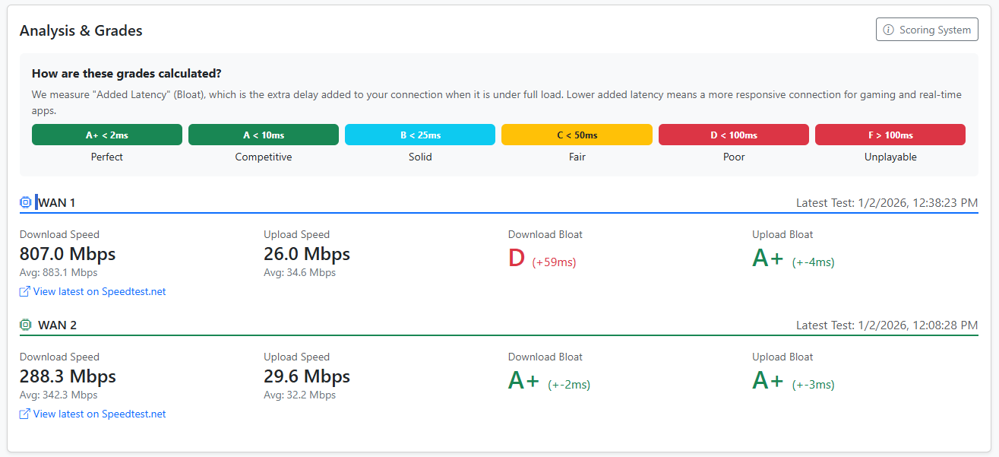
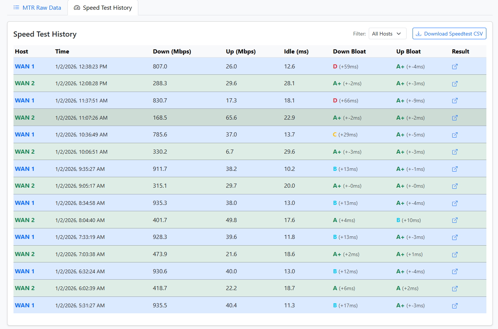

# Gateway Monitor


A professional-grade web application to monitor and compare multiple WAN connections. It tracks real-time latency using `mtr` and monitors Bufferbloat (latency under load) using the official Ookla Speedtest CLI.

[](https://opensource.org/licenses/MIT)

## Features
- **Latency Monitoring**: Continuous tracking of network health using `mtr` (My Traceroute).
- **Bufferbloat Tracking**: Integrated Ookla Speedtest to measure how your connection handles heavy load.
- **Dynamic Host Management**: Add, rename, or delete gateways (WANs) directly from the web dashboard.
- **Per-Host Configuration**: Set individual Speedtest Server IDs for each gateway to ensure the most accurate results for diverse connections (e.g., Fiber vs Starlink).
- **Comparison Visualizations**: Side-by-side charts for multiple connections with smart `(LOADED)` tooltip indicators.
- **Speed & Bloat Analytics**: Combined visualization of download speed, upload speed, and added latency on a single timeline.
- **Bufferbloat Grading System**: Automated scoring (A+ to F) based on added latency, calibrated for competitive gaming standards.
- **CSV Export**: Comprehensive export options for individual or combined datasets, now including a hop-specific filter for MTR data.
- **Mobile Responsive**: Clean, modern dashboard built with Bootstrap 5 and Chart.js.

## Security Recommendations

- **API Keys**: Keep your gateway API keys private. They are required for nodes to ingest data.
- **Maintenance Script**: The `api/maintenance.php` script handles data pruning. For production, it is highly recommended to protect this script with a secret key or restrict access to localhost/trusted IPs to prevent unauthorized database pruning.
- **Database Access**: Ensure your `includes/db.php` is not accessible from the web (it is excluded by `.gitignore`, but double-check your web server configuration).

## Architecture

The system uses a **Centralized Server** and multiple **Remote Nodes**:
1.  **Central Server**: Hosts the MySQL database and the PHP-based web dashboard.
2.  **Remote Nodes**: Any Linux machine (Ubuntu/Debian recommended) connected to a gateway you want to monitor. These run the collection scripts via `cron`.

## Installation & Setup

### 1. Server Setup (Ubuntu/Debian)

#### A. Install LAMP Stack
Ensure your server has Apache, MySQL, and PHP 8.1+ installed.
```bash
sudo apt update
sudo apt install apache2 mysql-server php php-mysql libapache2-mod-php
```

#### B. Database Initialization
1.  Log into MySQL and create the database:
    ```sql
    CREATE DATABASE gateway_monitor;
    ```
2.  Import the schema:
    ```bash
    mysql -u root -p gateway_monitor < sql/schema.sql
    ```

#### C. Web Files
1.  Clone or copy this repository to `/var/www/html/gateway_monitor`.
2.  Configure database access:
    ```bash
    cp includes/db.php.example includes/db.php
    nano includes/db.php
    ```
    *Update the host, database name, user, and password.*

### 2. Dashboard Configuration

1.  Open the dashboard in your browser (e.g., `http://your-server/gateway_monitor`).
2.  Click the **"Hosts"** button (CPU icon) in the navbar.
3.  **Add your Gateways**: Enter a name for each WAN connection (e.g., "Starlink", "Fiber Backup").
4.  **Copy API Keys**: Once added, each host will have a unique API Key. You will need these for the remote nodes.
5.  **Configure Views**: Use the dropdowns in the navbar to switch between latency metrics, specific hops, and speed test history.
6.  (Optional) Click **"Settings"** (Gear icon) to adjust global defaults like the default dashboard metric, test interval, and data retention.

### 3. Remote Node Setup (On each WAN)

On the machine physically connected to the WAN you want to monitor:

#### A. Install Dependencies
```bash
# Install MTR and Curl (Requires mtr 0.93+ for JSON support)
sudo apt install mtr-tiny curl

# Install Official Ookla Speedtest CLI (Required for JSON output)
curl -s https://packagecloud.io/install/repositories/ookla/speedtest-cli/script.deb.sh | sudo bash
sudo apt install speedtest
```

#### B. Configure Scripts
1.  Copy `scripts/monitor.sh` and `scripts/speedtest.sh` to the remote machine.
2.  Make them executable: `chmod +x *.sh`.
3.  Edit the configuration at the top of both scripts:
    *   `API_URL`: The URL to your server's API folder (e.g., `http://1.2.3.4/gateway_monitor/api`).
    *   `API_KEY`: The unique key you copied from the dashboard for **this specific host**.

#### C. Schedule Cron Jobs
Run `crontab -e` and add:
```bash
# Run Latency Monitor every minute
* * * * * /path/to/monitor.sh

# Run Bufferbloat Controller every minute (Smart Scheduling)
* * * * * /path/to/speedtest.sh
```

---

## Detailed Usage

### Managing Speedtest Servers
Accuracy in Bufferbloat testing depends on using a reliable nearby server.
- **Global Default**: Set in the "Settings" modal. Used by all hosts if they don't have a specific ID set.
- **Per-Host Override**: Set in the "Manage Gateways" modal. Ideal if your gateways are in different geographic regions or use different ISPs.
- *Find Server IDs at: [speedtest.net/performance/servers](https://www.speedtest.net/performance/servers)*

### Smart Scheduling
The `speedtest.sh` script runs every minute but only executes a test when instructed by the API.
- The API follows the `speedtest_interval` (default 60 mins).
- To bypass the timer and test immediately, run: `./scripts/speedtest.sh --force`.

### Bufferbloat Grading & Load Detection

*Note: Place your screenshots in `assets/img/` with the filenames shown above to display them in this README.*

The app measures **"Added Latency"** (Loaded Latency - Idle Latency). To keep graphs clean, visual shading has been replaced with smart markers and tooltips:
- **Orange Vertical Lines**: These mark the exact time a Speedtest was performed on any WAN connection.
- **(LOADED) Status**: When hovering over MTR latency points, the tooltip will display `(LOADED)` if that sample was captured during an active speed test. This status is also visible in the **MTR Raw Data** table. Correlated automatically via timestamps.

### Raw Data Exploration & Export

Below the chart, two tabs provide granular access to your data:
- **MTR Raw Data**: Shows every hop for every MTR run. Includes filters for specific Hosts and Hops.
- **Speed Test History**: Shows full details of every speed test, including raw latencies and Jitter.
- **Consolidated Exports**: Each tab features a "Download CSV" button that respects your active filters (Time, Host, and Hop).

#### Scoring Tiers:
- **A+ (< 2ms)**: Perfect. Zero perceptible delay under load.
- **A (< 10ms)**: Competitive. Ideal for pro gaming.
- **B (< 25ms)**: Solid. Great for casual gaming.
- **C (< 50ms)**: Fair. Noticeable "muddy" feeling.
- **D (< 100ms)**: Poor. Significant lag spikes.
- **F (> 100ms)**: Unplayable.

### Maintenance
The system includes an automatic cleanup mechanism:
- **Data Retention**: Set in the "Settings" modal (default 30 days).
- **Auto-Pruning**: The API automatically deletes records older than the retention period to keep the database lean and the dashboard fast.

---

## Understanding Metrics
- **Average (Avg)**: The mean latency. Good for general health.
- **Worst**: The highest latency recorded. Critical for identifying lag spikes.
- **StDev (Standard Deviation)**: Measures jitter. High StDev means an unstable connection.
- **Packet Loss (%)**: Percentage of packets that never returned.
- **Bufferbloat (Added Latency)**: The extra delay introduced when your connection is under heavy load. Measured in ms.
- **Speed Test (Mbps)**: Real-world bandwidth for Download and Upload. These are displayed together on a single graph for easier comparison.

## Troubleshooting
- **No Data on Charts**: 
    1. Run `./scripts/monitor.sh` manually on the remote node.
    2. Check for errors like "mtr: command not found" or "Unauthorized".
    3. Ensure `mtr` version 0.93+ is installed (`mtr --version`). Older versions do not support the `--json` flag.
    4. If using an older OS, you may need to compile `mtr` from source or use a newer repository.
- **Speedtest Fails**:
    1. Run `./scripts/speedtest.sh --force` manually.
    2. Ensure the official Ookla Speedtest CLI is installed, NOT the `speedtest-cli` python package.
    3. Verify your API Key and `API_URL` are correct in the script.
- **Permission Denied**:
    1. Ensure the scripts are executable: `chmod +x scripts/*.sh`.
    2. Some systems require `sudo` for `mtr` if not correctly configured with capabilities. If so, update your crontab to use `sudo`.

## Verifying the Installation
1.  **Check API**: Run `./scripts/speedtest.sh --force` manually on a node. It should report "Ingestion complete."
2.  **Check Database**: 
    ```sql
    SELECT name, last_speed_test FROM hosts;
    ```
3.  **Check Dashboard**: Open `index.php`. You should see the chart and Bufferbloat Report Card.

---

## Contributing

Contributions are welcome! Please see [CONTRIBUTING.md](CONTRIBUTING.md) for guidelines.

## License

This project is licensed under the MIT License - see the [LICENSE](LICENSE) file for details.
